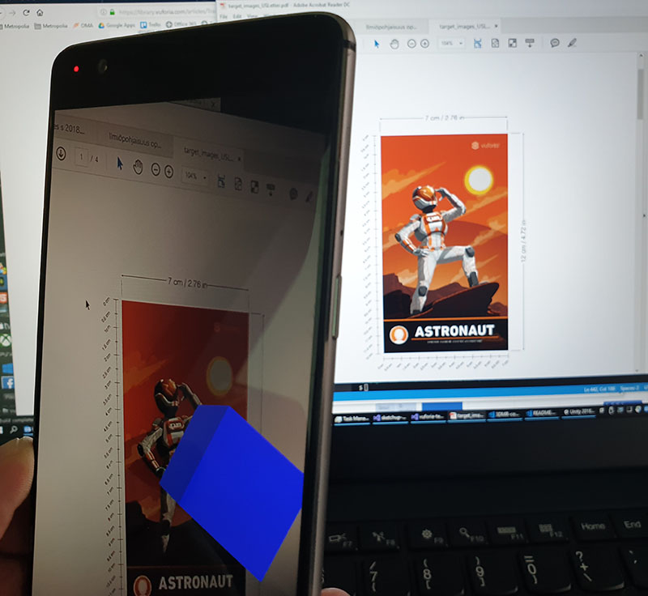

# Unity assignment 4: Augmented reality with Vuforia Engine

## About Vuforia

- SDKs for Unity, Android & iOS
- 3rd party AR engine for Unity, officially supported by Unity until Jan, 2020
- cross-platform, build for Android & iOS
- easy to get started with and test
- gives you an idea what the AR development is

## Instructions

Read the [Getting Started documentation](https://library.vuforia.com/articles/Training/getting-started-with-vuforia-in-unity.html) for Unity.

1. Add [Vuforia Engine package](https://library.vuforia.com/content/vuforia-library/en/articles/Solution/vuforia-engine-package-hosting-for-unity.html) to Unity project (installation script can be found from Oma documents)
1. Remove Main Camera and add AR Camera: _GameObject -> Vuforia Engine -> AR Camera_, import stuff when prompted
1. Add Vuforia Android support to your project (optional step for development but needed for testing/running in mobile device) : open _File -> Build settings_, switch platform to Android ([Install Android SDK](../assets/unity-android-sdk-install.png) if missing) and modify _Player Settings..._:
    - set _product name_ and _package name_
    - set _minimun API level_ according to the age of the target devices you want to support (Lollipop level should be fine in most cases)
    - Disable _Android TV compatibility_
    - Enable _Vuforia AR_ in _XR settings_ and accept the license (for Unity versions 2018.4 and earlier)
1. Add target image (marker) and import the default image database:
    - _GameObject -> Vuforia Engine -> Image Target_
    - Change _Type_ in _Inspector_: _From Image_ -> _From Database_
    - Import default target database
    - Choose one of the provided image targets
1. Add content (e.g. some 3D object(s)) as a child of the ImageTarget game object
1. Build and run on a device (or use the [Vuforia play mode](https://library.vuforia.com/content/vuforia-library/en/articles/Solution/vuforia-play-mode-in-unity.html) and a webcam)
    - allow permission to use the camera of the device

    3D object should be visible when pointing to target image (printed of pdf on screen) with device's camera:

    

1. Develop further, some ideas:
   - use your own 3D models
   - add your own targets
   - add user interaction

If you want use your own (image) targets:

1. [Register for a Vuforia Developer Account](https://developer.vuforia.com/) and log in
2. Create a license key and add the key to Vuforia Configuration in Unity
3. Use [Target manager](https://developer.vuforia.com/vui/develop/databases) to create a target database and add your images
4. Download the database as an unity package and import to Unity

## Grading (max. 2 points)

- Getting started tutorial done: 1 p.
- Features designed by yourself added: 1 p.  

## Guidelines for Unity tasks

- 2-step returning:
  1. return your Unity project to oma: Create a zip-file of your project folder containing only _Assets_ and _ProjectSettings_ subfolders
  2. present project "live" to teacher latest at next day after the deadline to get the points
- always list used references & sources in code comments or in a separate readme file
- grading when returning late: less than a week: -50 %, more: -70-100 %

## Optional assignment

For those who can't do the Vuforia assignment because of not having the required hardware (supported mobile device or webcam) for doing it.

1. Write an essay of 2 pages max. (~1000 words) about the differences and usage of different AR technologies (ARKit, ARCore, Vuforia, ...).
2. Return to Oma in **PDF** format (Unity assignmnent 4).
